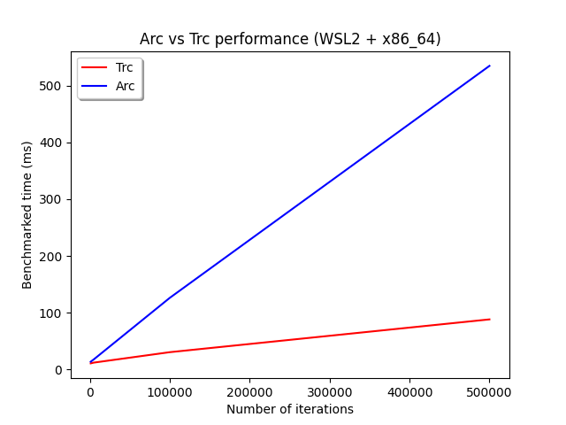
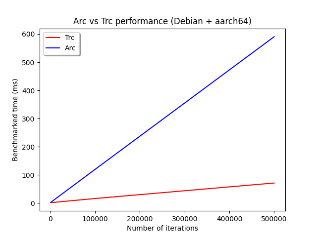

# Benchmarks

Test platforms:
- WSL2 5.15.90 + Intel Xeon E3-1535M (x86_64)
- Ubuntu 20.04 + Intel Xeon Platinum 8358 (x86_64)
- Debian 6.1.20 + ARM Neoverse-N1 (aarch64)

## WSL2 5.15.90 + Intel Xeon E3-1535M (x86_64)

```shell
curl --proto '=https' --tlsv1.2 -sSf https://sh.rustup.rs | sh
source "$HOME/.cargo/env"
git clone https://github.com/EricLBuehler/trc.git
cd trc
# Benchmarks
cargo install cargo-criterion
cargo criterion
# Tests
rustup +nightly component add miri
cargo +nightly miri test
MIRIFLAGS="-Zmiri-strict-provenance" cargo +nightly miri test
MIRIFLAGS="-Zmiri-symbolic-alignment-check" cargo +nightly miri test
MIRIFLAGS="-Zmiri-tree-borrows" cargo +nightly miri test
```

<span style="color:green">**All tests passed**</span>.

### Clone
| Type | Mean time |
| --- | ----------- |
| Trc | 36.201ns |
| Arc | 43.793ns |
| Rc | 14.112ns |

### Multiple Clone (100 times)
| Type | Mean time |
| --- | ----------- |
| Trc | 350.000ns |
| Arc | 1331.900ns |
| Rc | 303.73ns |

### Deref
| Type | Mean time |
| --- | ----------- |
| Trc | 26.978ns |
| Arc | 24.745ns |
| Rc | 12.249ns |

### Multiple Deref (100 times)
| Type | Mean time |
| --- | ----------- |
| Trc | 55.148ns |
| Arc | 54.261ns |
| Rc | 44.764ns |

### Multiple Threads Drop and Clone (1000 times)
| Type | Mean time |
| --- | ----------- |
| Trc | 10.945ms |
| Arc | 13.754ms |

### Multiple Threads Drop and Clone (5000 times)
| Type | Mean time |
| --- | ----------- |
| Trc | 12.300ms |
| Arc | 18.104ms |

### Multiple Threads Drop and Clone (100000 times)
| Type | Mean time |
| --- | ----------- |
| Trc | 30.666ms |
| Arc | 126.330ms |

### Multiple Threads Drop and Clone (500000 times)
| Type | Mean time |
| --- | ----------- |
| Trc | 88.387ms |
| Arc | 534.67ms |




## Ubuntu 20.04 + Intel Xeon Platinum 8358 (x86_64)

```shell
sudo apt update
curl --proto '=https' --tlsv1.2 -sSf https://sh.rustup.rs | sh
source "$HOME/.cargo/env"
git clone https://github.com/EricLBuehler/trc.git
cd trc
# Benchmarks
cargo install cargo-criterion
cargo criterion
# Tests
rustup +nightly component add miri
cargo +nightly miri test
MIRIFLAGS="-Zmiri-strict-provenance" cargo +nightly miri test
MIRIFLAGS="-Zmiri-symbolic-alignment-check" cargo +nightly miri test
MIRIFLAGS="-Zmiri-tree-borrows" cargo +nightly miri test
```

<span style="color:green">**All tests passed**</span>.

### Clone   
| Type | Mean time |
| --- | ----------- |
| Trc | 26.913ns |
| Arc | 33.803ns |
| Rc | 11.228ns |

### Multiple Clone (100 times)
| Type | Mean time |
| --- | ----------- |
| Trc | 423.020ns |
| Arc | 1273.200ns |
| Rc | 352.920ns |

### Deref
| Type | Mean time |
| --- | ----------- |
| Trc | 20.802ns |
| Arc | 20.802ns |
| Rc | 9.264ns |

### Multiple Deref (100 times)
| Type | Mean time |
| --- | ----------- |
| Trc | 35.577ns |
| Arc | 35.853ns |
| Rc | 29.454ns |

### Multiple Threads Drop and Clone (1000 times)
| Type | Mean time |
| --- | ----------- |
| Trc | 2.80ms |
| Arc | 4.02ms |

### Multiple Threads Drop and Clone (5000 times)
| Type | Mean time |
| --- | ----------- |
| Trc | 3.480ms |
| Arc | 9.415ms |

### Multiple Threads Drop and Clone (100000 times)
| Type | Mean time |
| --- | ----------- |
| Trc | 18.451ms |
| Arc | 137.980ms |

### Multiple Threads Drop and Clone (500000 times)
| Type | Mean time |
| --- | ----------- |
| Trc | 71.490ms |
| Arc | 638.180ms |


## Debian 6.1.20 + ARM Neoverse-N1 (aarch64)

```shell
curl --proto '=https' --tlsv1.2 -sSf https://sh.rustup.rs | sh
source "$HOME/.cargo/env"
git clone https://github.com/EricLBuehler/trc.git
cd trc
sudo apt install git
sudo apt install build-essential
# Benchmarks
cargo install cargo-criterion
cargo criterion
# Tests
rustup +nightly component add miri
cargo +nightly miri test
MIRIFLAGS="-Zmiri-strict-provenance" cargo +nightly miri test
MIRIFLAGS="-Zmiri-symbolic-alignment-check" cargo +nightly miri test
MIRIFLAGS="-Zmiri-tree-borrows" cargo +nightly miri test
```

<span style="color:green">**All tests passed**</span>.


### Clone
| Type | Mean time |
| --- | ----------- |
| Trc | 45.005ns |
| Arc | 42.873ns |
| Rc | 16.684ns |

### Multiple Clone (100 times)
| Type | Mean time |
| --- | ----------- |
| Trc | 422.680ns |
| Arc | 1208.100ns |
| Rc | 353.41ns |

### Deref
| Type | Mean time |
| --- | ----------- |
| Trc | 28.721ns |
| Arc | 32.815ns |
| Rc | 14.134ns |

### Multiple Deref (100 times)
| Type | Mean time |
| --- | ----------- |
| Trc | 62.983ns |
| Arc | 61.937ns |
| Rc | 48.643ns |

### Multiple Threads Drop and Clone (1000 times)
| Type | Mean time |
| --- | ----------- |
| Trc | 1.883ms |
| Arc | 2.913ms |

### Multiple Threads Drop and Clone (5000 times)
| Type | Mean time |
| --- | ----------- |
| Trc | 2.424ms |
| Arc | 7.672ms |

### Multiple Threads Drop and Clone (100000 times)
| Type | Mean time |
| --- | ----------- |
| Trc | 16.535ms |
| Arc | 119.950ms |

### Multiple Threads Drop and Clone (500000 times)
| Type | Mean time |
| --- | ----------- |
| Trc | 71.543ms |
| Arc | 590.530ms |

