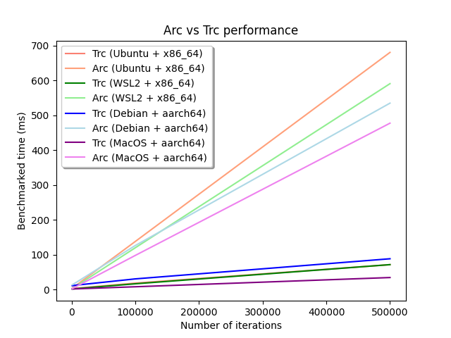

# Trc

[](LICENSE)


`Trc` is a performant heap-allocated smart pointer for Rust that implements thread reference counting.
`Trc` stands for: Thread Reference Counted.
`Trc` provides a shared ownership of the data similar to `Arc<T>` and `Rc<T>`.
It implements thread reference counting, which is based on the observation that most objects are only used by one thread.
This means that two reference counts can be created: one for thread-local use, and one atomic one for sharing between threads.
Thread reference counting sets the atomic reference count to the number of threads using the data.

A cycle between `Trc` pointers cannot be deallocated as the reference counts will never reach zero. The solution is a `Weak<T>`.
A `Weak<T>` is a non-owning reference to the data held by a `Trc<T>`.
They break reference cycles by adding a layer of indirection and act as an observer. They cannot even access the data directly, and
must be converted back into `Trc<T>`. `Weak<T>` does not keep the value alive (which can be dropped), and only keeps the backing allocation alive.

To soundly implement thread safety `Trc<T>` does not itself implement `Send` or `Sync`. However, `SharedTrc<T>` does, and it is the only way to 
safely send a `Trc<T>` across threads. See `SharedTrc` for it's API, which is similar to that of `Weak`.


## Examples

Example of `Trc<T>` in a single thread:
```rust
use trc::Trc;

let mut trc = Trc::new(100);
assert_eq!(*trc, 100);
*Trc::get_mut(&mut trc).unwrap() = 200;
assert_eq!(*trc, 200);
```

Example of `Trc<T>` with multiple threads:
```rust
use std::thread;
use trc::Trc;
use trc::SharedTrc;

let trc = Trc::new(100);
let shared = SharedTrc::from_trc(&trc);
let handle = thread::spawn(move || {
    let trc = SharedTrc::to_trc(shared);
    assert_eq!(*trc, 100);
});

handle.join().unwrap();
assert_eq!(*trc, 100);
```

Example of `Weak<T>` in a single thread:
```rust
use trc::Trc;
use trc::Weak;

let trc = Trc::new(100);
let weak = Trc::downgrade(&trc);
let mut new_trc = Weak::upgrade(&weak).unwrap();
assert_eq!(*new_trc, 100);
drop(trc);
drop(weak);
*Trc::get_mut(&mut new_trc).unwrap() = 200;
assert_eq!(*new_trc, 200);
```

Example of `Weak<T>` with multiple threads:
```rust
use std::thread;
use trc::Trc;
use trc::Weak;

let trc = Trc::new(100);
let weak = Trc::downgrade(&trc);

let handle = thread::spawn(move || {
    let trc = Weak::upgrade(&weak).unwrap();
    assert_eq!(*trc, 100);
});
handle.join().unwrap();
assert_eq!(*trc, 100);
```

## Benchmarks
Benchmarks via Criterion. As can be seen, `Trc`'s performance really shines when there are many Clones.
The reason `Trc` does not do as well for fewer operations is that it needs to allocate `n+1` blocks of memory for `n` threads, and
so for 1 thread, there are 2 allocations. However, after the initial allocations, `Trc` performs very well - 3.81x `Arc`'s time for Clones. 

Click [here](BENCHMARKS.md) for more benchmarks. Multiple different operating systems, CPUs, and architectures are tested. 

### Clone   
| Type | Mean time |
| --- | ----------- |
| Trc | 26.913ns |
| Arc | 33.803ns |
| Rc | 11.228ns |

### Multiple Clone (100 times)
| Type | Mean time |
| --- | ----------- |
| Trc | 423.020ns |
| Arc | 1273.200ns |
| Rc | 352.920ns |

### Deref
| Type | Mean time |
| --- | ----------- |
| Trc | 20.802ns |
| Arc | 20.802ns |
| Rc | 9.264ns |

### Multiple Deref (100 times)
| Type | Mean time |
| --- | ----------- |
| Trc | 35.577ns |
| Arc | 35.853ns |
| Rc | 29.454ns |

### Multiple Threads Drop and Clone (1000 times)
| Type | Mean time |
| --- | ----------- |
| Trc | 2.80ms |
| Arc | 4.02ms |

1.44x faster - because of the allocation cost of `SharedTrc`.

### Multiple Threads Drop and Clone (5000 times)
| Type | Mean time |
| --- | ----------- |
| Trc | 3.480ms |
| Arc | 9.415ms |

2.71x faster - the allocation cost of `SharedTrc` begins to become replaced by the `Clone` efficiency.

### Multiple Threads Drop and Clone (100000 times)
| Type | Mean time |
| --- | ----------- |
| Trc | 18.451ms |
| Arc | 137.980ms |

7.44x faster - the allocation cost of `SharedTrc` is now negligible and the `Clone` advantage is beginning to be demonstrated.

### Multiple Threads Drop and Clone (500000 times)
| Type | Mean time |
| --- | ----------- |
| Trc | 71.490ms |
| Arc | 638.180ms |

8.92x faster - the allocation cost of `SharedTrc` is now negligible and the `Clone` advantage is demonstrated.



## Use
To use `Trc`, simply run `cargo add trc`, or add `trc = "1.1.18"`. Optionally, you can always use the latest version by adding `trc = {git = "https://github.com/EricLBuehler/trc.git"}`.
